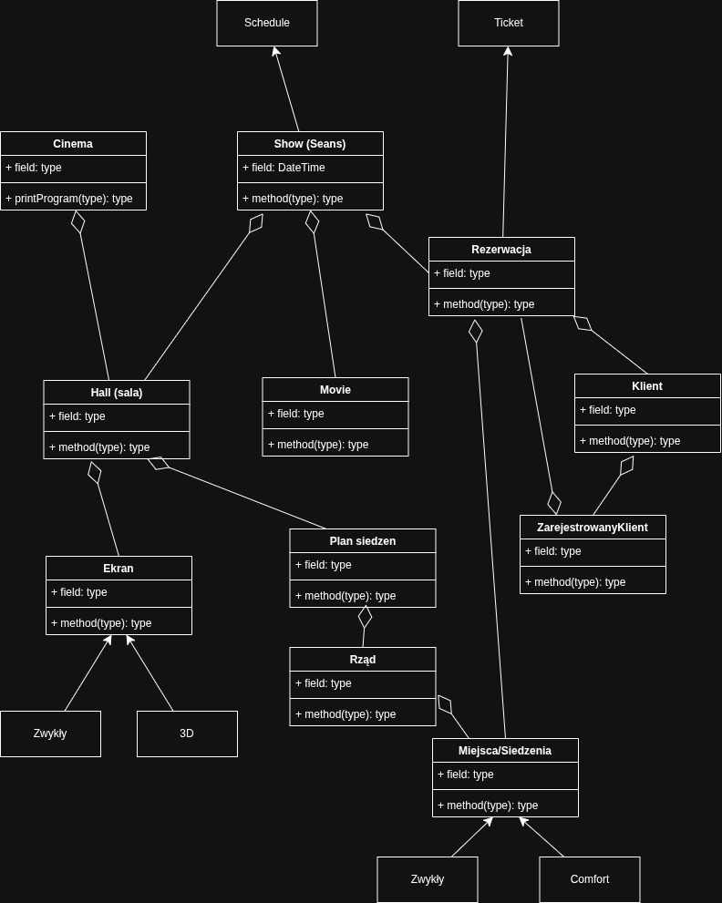

# mhuMultipleks

Warstwa struktury:
- Cinema -> Hall + Screen -> Row -> Seat

Warstwa repertuaru:
- Movie (Ma tytuł, rezysera, opis, czas trwania)
- Show (Ma jeden movie, jeden HAll, data)
- Schedule (Ma wiele Show)

Warstwa rezerwacji:
- Reservation (Ma Customer, Ma wiele Seat, Ma Show)
- Customer (Ma email)
- Ticket (Ma jedną rezerwację)

Notatki:
- Rozplanowanie rezerwacji

## Schemat UML

